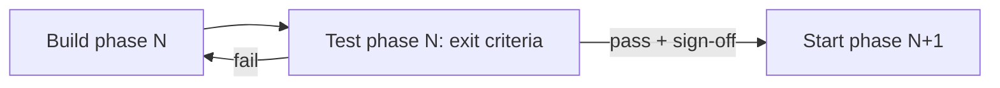
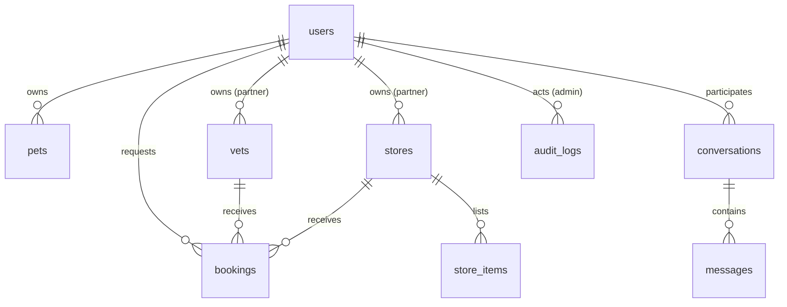
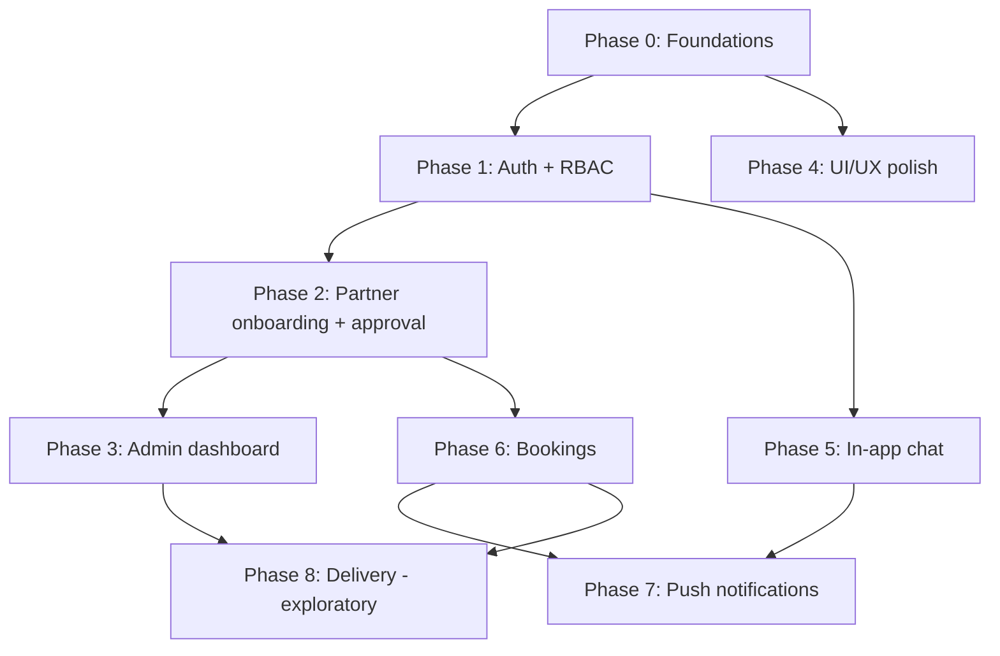

# Petly Platform Implementation Plan

Big, multi-phase plan to evolve Petly from an anonymous MVP into a full pet-services
platform. This document is the source of truth for scope and sequencing; keep it up to
date as phases land.

## Key decisions (assumptions — revisit if priorities change)

- Admin dashboard stack: reuse the existing Flutter app as a single codebase with a
  responsive, role-gated admin area (rich layout on web, usable on mobile). Rationale: a
  working Flutter web build already exists and it keeps one language/toolchain.
  Alternative: a dedicated React/Next admin if heavier data-grid ergonomics are needed.
- Authentication: custom JWT + RBAC in the Node/Express backend (bcrypt, access + refresh
  tokens, roles `client | partner | admin`). Rationale: keeps everything in the current
  stack, no vendor lock-in. Alternative: Firebase Auth (managed, social login) — Firebase
  is still planned later for push notifications regardless.
- Chat transport: real-time via Socket.IO/WebSocket, with WhatsApp deep-links kept as a
  fallback contact method.
- Delivery service: EXPLORATORY / unconfirmed (Phase 8) — discovery and design spike
  only, no build until confirmed.
- Data layer: Prisma ORM against PostgreSQL 16 (no in-memory fallback). Docker Compose
  Postgres is required for local development, CI, and tests.

## Execution model: one phase at a time, with a testing gate

- Development proceeds strictly phase by phase in the order below and per the dependency
  graph; a phase is not started until the previous phase is complete and signed off.
- Every phase ends with a mandatory testing gate and is only considered "done" once it
  passes the exit criteria below.
- Each phase ships on its own branch/PR, with testing evidence attached to the PR before
  merge.

Per-phase Definition of Done (testing gate):

- Automated tests: backend unit/integration tests for new endpoints/services and Flutter
  widget/unit tests for new UI/logic, all passing in CI.
- Lint & build: `tsc` build and `flutter analyze` clean; app builds for web and mobile.
- Manual / E2E: the phase's core flow is exercised end to end against PostgreSQL, with
  evidence captured (screenshots / short video).
- Regression: key flows from prior phases still pass.
- Sign-off: reviewer approves the PR and confirms exit criteria are met before the next
  phase begins.

## Current state (what exists)

- Backend: Express + TS, modules `auth, users, pets, vets, stores, analytics,
  partners, admin`; Prisma 6 schema + migrations under `backend/prisma` (users, pets,
  vets, stores, whatsapp clicks, refresh tokens, listing ownership/status/hours,
  and store items).
  JWT access + refresh, bcrypt, `requireAuth` / `requireRole`, roles
  `client | partner | admin`. Public `GET /vets` and `GET /stores` return
  `status = approved` only.
- Mobile/Web: Flutter (Riverpod + GoRouter + Dio), login/register/forgot-password,
  partner dashboard + listing forms, secure token storage, bearer + refresh interceptor,
  route guards. Guest browsing remains via device-bound users (`user_provider.dart`);
  registering with `device_id` upgrades the guest so pets stay attached.
- Seeded admin: `ADMIN_EMAIL` / `ADMIN_PASSWORD` (defaults `admin@petly.local` /
  `changeme-admin`). Seeded partner: `partner@petly.local` / `changeme-partner`.
- Geo-location already partially done (original Phase 1.5); contact is via WhatsApp
  deep links.

## Target data model additions

## Phase dependencies

## Phase 0 - Foundations & housekeeping

- Prisma ORM + versioned Prisma Migrate (`backend/prisma`); `db:seed` runs
  `prisma migrate deploy` first. PostgreSQL is required (in-memory fallback removed).
- Add request validation (`zod`) via a reusable middleware, plus security middleware
  (`helmet`, rate limiting, configurable CORS).
- Config/secrets: `JWT_SECRET`, token TTLs, and CORS origins in
  `backend/src/config/env.ts` and `.env.example`.
- Flutter design-system prep: semantic tokens in `mobile/lib/core/theme/app_tokens.dart`
  wired into the theme.
- CI: backend build + tests and `flutter analyze` + tests on PRs.

## Phase 1 - Authentication & RBAC (foundational) — done

- Backend `auth` module: `register`, `login`, `refresh`, `logout`, `me`; bcrypt hashing;
  JWT access + refresh; `requireAuth` and `requireRole` middleware. Extend `users` with
  `email`, `password_hash`, `role`, `status`; keep `device_id` for guest -> account
  linking.
- Seed an initial `admin` account.
- Flutter: login/register/forgot-password screens, auth state via Riverpod, secure token
  storage, Dio interceptor for bearer token + refresh on 401, route guards.
- Forgot-password API is a non-enumerating stub (no email delivery yet).

## Phase 2 - Partner onboarding & approval workflow — done

**Runbook for a new agent:** [PHASE_2_PLAN.md](./PHASE_2_PLAN.md) (locked decisions, API
contracts, files, tests, and Definition of Done). Implement from that file; do not
start Phase 3 in the same PR.

- Schema: add `owner_user_id`, `status`, `rejection_reason`, `submitted_at`,
  `reviewed_at`, `reviewer_id` to `vets` and `stores`.
- Public listings filter to `status = approved`.
- Partner self-service: submit/edit their vet/store (goes `pending`), manage
  hours/services; partner dashboard screens.
- Minimal admin review API (`GET /admin/listings`, `PATCH /admin/vets|:stores/:id/review`).
  Flutter admin UI is Phase 3.

## Phase 3 - Admin dashboard (web + mobile, role-gated)

- Backend admin endpoints (guarded by `requireRole('admin')`) with pagination/search:
  approvals queue, vet/store CRUD + delete, client management (list/search/edit/
  suspend/delete, view pets), featured toggle, admin analytics, `audit_logs`.
- Flutter admin area (responsive): approvals queue (accept/reject + reason), listings
  management, client management, featured listings, analytics reusing `whatsapp_clicks`
  plus new events.

## Phase 4 - UI/UX polish: animations, backgrounds, colors — done (palette refresh)

- Palette: olive-leaf `#606C38`, black-forest `#283618`, cornsilk `#FEFAE0`,
  sunlit-clay `#DDA15E`, copperwood `#BC6C25`. Light pages use cornsilk + forest
  text; dark pages invert to forest surfaces and cornsilk type. Copper/clay are
  the warm accents (emergency, secondary). WhatsApp CTAs keep vendor green.
- Backgrounds: cornsilk→clay wash (dark: forest canopy) with 6 outline paw SVGs
  on Home, Auth, and Explore.
- Listing photos: `image_url` on vets/stores, seeded bundled assets, 16:9 photo
  cards, detail heroes, quieter WhatsApp on list cards (full green CTA on detail).
- Motion: fade/slide page transitions, staggered lists, skeleton loaders,
  button scale micro-interaction. Empty-search copy + Explore emergency chip.

- Re-validate palette for WCAG AA contrast; semantic tokens + dark theme; refined
  gradients from `#2EC4B6`/`#FF9F1C`.
- Backgrounds: subtle gradient/blob/pattern layers behind home + auth; light
  illustrations.
- Animations: page transitions, hero images, staggered lists, skeleton loaders, Lottie
  for empty/success/error states, micro-interactions.

## Phase 5 - In-app chat (client <-> vet/store)

- Schema: `conversations`, `messages` (auth-scoped), unread counts.
- Backend: REST for history + Socket.IO gateway for real-time; participant-only
  authorization.
- Flutter: conversation list, chat screen, unread badges; WhatsApp deep-link kept as
  alternate contact.

## Phase 6 - Bookings / appointment requests

- Schema: `bookings` (client, target vet/store, pet, service, requested time, status),
  partner availability/hours.
- Flows: client request + status tracking; partner accept/decline/reschedule; admin
  oversight.

## Phase 7 - Push notifications (FCM)

- Firebase Cloud Messaging for chat, bookings, and approval events; device-token
  registration; in-app notification center. Can be pulled earlier if chat/bookings need
  push at launch.

## Phase 8 - Delivery service (EXPLORATORY - NOT CONFIRMED)

- Discovery/spike only: scope options (in-house couriers vs. 3rd-party integration),
  draft data model (`orders`, `deliveries`, tracking), payments/regulatory considerations
  for Lebanon. No implementation until confirmed.

## Cross-cutting / suggested improvements

- Image uploads (vet/store logos, pet photos) via object storage (S3/Cloudinary).
- Ratings & reviews for vets/stores.
- i18n EN/AR + RTL (Lebanon audience).
- Accessibility pass (semantics, focus, contrast).
- Observability (structured logging, error tracking) and API rate limiting.
- Pagination/search across all list endpoints.
- Admin audit log surfaced in the dashboard.
